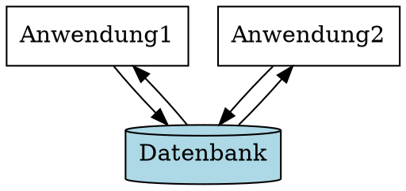

# Slides
[Datenbanken Einführung](file:///home/malte/OneDriver/01_Studium/3.Semester/Datenbanken/Slides/dbs1_01.pdf)

## Arbeitsspeicher vs. Externspeicher

| Arbeitsspeicher                  | Externspeicher                           |
|----------------------------------|------------------------------------------|
| Rein elektronisch                | Speicherung auf magnetisierbaren Platten |
| Flüchtig                         | Nicht Flüchtig                           |
| Schnelle Zugriffszeit $(10 ns)$  | Langsamer Zugriff $(10 ms)$              |
| wahlfreier Zugriff               | Blockweiser Zugriff                      |
| Teuer (60€ für 16GB)             | Billiger (102€ für 3000 GB)              |

### Technologie des Hauptspeichers
- Feldeffekt Transistor (FET): 
  Elektronischer Schalter, der durch ein elektrisches Feld gesteuert wird. 
   
- Bereich zwischen Source und Drain ist normal nicht leitend (Sperrschicht)
- Durch Anlegen einer Spannung zwischen Bulk und Gate wird die Sperrschicht vergrößert oder verkleinert. 
  So wandern Elektronen in diesem Bereich und dieser wird leitend.

### DRAM (Dynamic Random Access Memory)
- Ein Bit besteht aus nur 2 Bauteilen: Kondensator (Akku) und Transistor (Feldeffekttransistor)
- Arbeitsweise:
	- Kondensator kann nur wenig Ladung aufnehmen, daher muss er regelmäßig aufgefrischt werden (Refresh)
	- Der Speicherinhalt eines Bits kann durch das Anlegen einer Spannung auf der 
	  Wortleitung gelesen werden.

### Flash Memory
- In Memory Karten, USB Sticks, SSDs
- Ist ein nicht flüchtiger Halbleiterspeicher
- **Eigenschaften**:
	- (-) Begrenzte Zahl von Schreibzyklen
	- (-) Daher nicht verwendbar als Arbeitsspeicher
	- (+) Keine beweglichen Teile
	- (+) Deutlich schneller und Robuster als Festplatten
	- (+) Geringer Platzbedarf

## Aufbau einer Festplatte
> Mehrere magnetisierbare Platten rotieren um gemeinsame Achse.
> Ein Kamm mit je zwei Scheiben/Leseköpfen pro Platte (unten u. oben) 
> bewegt sich in radialer Bewegung über die Platten.

**Plattenoberfläche**:
- Spuren: Kreisförmige Spuren auf der Plattenoberfläche
- Sektoren: Sektoren sind die kleinsten adressierbaren Einheiten auf der Plattenoberfläche
- (interne) Adresssierung einer Information:
  
  `[Platten-Nr. | Oberfl. Nr. | Spur Nr. | Sektor Nr. | Byte Nr.]`

### Lesen und Schreiben auf Festplatte
- Positionierung des Kamms mit dem Schreib-/Lesekopf auf der Spur
- Warten bis die Platte so weit rotiert ist, dass der Beginn 
  des richtigen Sektors unter dem Schreib-/Lesekopf liegt
- Übertragung der Information von der Platte in den Arbeitsspeicher

> :warning: **Warning:** Es ist aus technischen Gründen nicht möglich, einzelne Bytes zu lesen
> oder zu schreiben. **Es muss immer ein ganzer Sektor gelesen oder geschrieben werden.**

### Zugriffszeit 
**Setzt sich zusammen aus:**

- **Suchzeit**: Zeit, die benötigt wird, um den Kamm auf die richtige Spur zu positionieren
- **Latenzzeit**: Zeit, die benötigt wird, bis der richtige Sektor unter dem Schreib-/Lesekopf liegt. 
  (= Wartezeit wegen Rotation)
- **Transferzeit**: Zeit, die benötigt wird, um die Information vom Schreib-/Lesekopf in den 
  Arbeitsspeicher zu übertragen. 
  Typische Transferrate: 200 Mbyte/s.
  Ein Sektor á 512 Byte wird in 2,56 µs übertragen.

### Redundanz bei Daten
- **Redundanz**: Mehrfache Speicherung von Daten
- **Konsequenz**: Änderungs-Anomalien (bei Änderung einer Adresse müssen ganz viele Dateien nach den Einträgen durchsucht werden)

### Schnittstellenproblematik


#### Weitere Probleme von Dateiverwaltungssystemen
- Synchrone Kommunikation und Zugriffe
- Gefahr von Datenverlust bei Systemabsturz
- Unflexible Zugriffskontrolle

→  **Lösung**: Datenbanken

# Datenbanken

> Einheitliche Speicherung aller Daten

## Komponenten eines DBS
- **DB-Anwendung**: Programm, das auf die Datenbank zugreift (= Kommunikation)
- **DBMS**: Datenbank_Management-System (Software), die die Datenbank verwaltet
- **DBS**: (DB + DBMS)
- **Datenbank**: Gesamtheit aller Daten

## DBS - Aufgaben
1. **Beschreibung**
2. **Speicherung**
3. **Wiedergewinnung**

## DBS - Anforderungen
1. **Integration**: Einheitliche Verwaltung aller von Anwendungen benötigten Daten. 
  Redundanzfreie Datenhaltung des gesamten Datenbestandes.
2. **Operationen**: Operation zur Speicherung, Recherche und Manipulation der Daten
3. **Data Dictionary**: Beschreibung der Daten und der Datenbank (= Katalog)
4. **Benutzersichten**: Jeder Benutzer sieht nur die für ihn relevanten Daten
5. **Konsistenz Überwachung**: Das DBMS überwacht die Korrektheit der Daten bei Änderungen
6. **Zugriffskontrolle**: Ausschluss unberechtigter Zugriffe
7. **Transaktionen**: Mehrere Operationen werden als eine Einheit ausgeführt und deren Effekt bei Erfolg permanent in DB gespeichert 
8. **Synchronisation**: Mehrere Benutzer können gleichzeitig auf die Datenbank zugreifen
9. **Datensicherung**: Sicherung der Daten gegen Verlust bei Systemabsturz

## Datenbankschema vs. Ausprägung/Datenbank-Zustand
**Datenbankschema**:
- Beschreibt mögliche Inhalte der DB
- Struktur und Typ Informationen der Daten
- Art der Beschreibung vorgegeben durch Datenmodell
- Änderung möglich aber selten

**Ausprägung bzw. Datenbank-Zustand**:
- Tatsächliche Inhalte der DB
- Objektinformation, Attributwerte
- Struktur vorgegeben durch Datenbankschema
- Änderung häufig


# Datenbank-Sprachen
## Data definition Language (DDL)
- Deklaration zur Beschreibung des Schemas
- Bei relationale DBs: Anlegen und Löschen von Tabellen, Intigritätsbedingungen ...
- 

## Data Manipulation Language (DML)
- Anweisungen zur Manipulation der Daten
- lässt sich weiter Unterteilen in Konstrukte:
	- zum reinen Lesen der DB (Anfragesprachen)
	- zum Manipulieren
**Bsp.**: SQL für relationale DB:
```sql
	SELECT *
	FROM Mitarbeiter
	WHERE Name = 'Müller'
```

## Datenmodelle
- Formalismen zur Beschreibung des DB-Schemas:
	- Objekte der DB
	- Beziehungen zw versch Objekten
	- Integritätsbedingungen
- Verschiedene Datenmodelle unterscheiden sich in der Art und Weise, 
  wie  Objekte und Beziehungen dargestellt werden
- z.B. Hierarchisch: Baum vs Relational: Tabelle

**Die wichtigesten Datenmodelle sind**:
- Hierarchisches Datenmodell
- Netzwerk Datenmodell
- Relationales Datenmodell!
- Objekt-orientiertes Datenmodell
- Objekt-relationales Datenmodell
- ("NoSQL-Datenbanken")

### Realationales Datenmodell
- Alle Informationen werden in Form von Tabellen gespeichert
- Tabellen bestehen aus einer Menge von Tabellen **(Relationen)**
- Jede Zeile = Tupel
- Jede Spalte = Attribut
- Die Attribute haben primitive Datentypen
- Komplexe Sachverhalte werden durch Verknüpfungen 
  mehrerer Tabellen dargestellt

### Hierarchisches Datenmodell
- Schema + Daten werden durch einen Baum strukturiert
- Der gesamte Datenverband muss hierarchisch repräsentiert sein (oft schwierig)

### Netzwerk Datenmodell
- Schema + Daten werden durch einen Graphen strukturiert


### Objekt-orientiertes Datenmodell
- In der Datenbank werden Objekte, d.h. Ausprägungen von Klassen 
  die zueinander in verschiedenen Beziehungen stehen, persistent gespeichert
- Rein Objektorientierte Datenbanken sind selten und haben sich kaum durchgesetzt
- Relationale DBs haben objektorientierte Erweiterungen →  **Objekt-relationales Datenmodell**

### NoSQL-Datenbanken
- Sammelbegriff für viele neuerer Entwicklungen, u.a.:
	- Dokumentorientierte Speichersysteme
	- Graphen-Datenbanken
	- Key-Value-Datenbanken
- Unterstützt meist laufzeitkritische Anwendungen
- Oft eingeschränkte Konsistenz-Überwachung

# Verbindung zur Applikation
- Verwendung einer Library (OCI (Oracle Call Interface), JDBC, ODBC, ...)
- DDL/DML-Anweisungen als Parameter an die Library

Beispiel für eine Verbindung mit JDBC:
```java
String q = "SELECT * FROM Mitarbeiter WHERE Name = 'Müller'";
Statement stmt = con.createStatement();
ResultSet rs = stmt.executeQuery(q);
```

# Architektur eines DBS
**Drei-Ebenen-Architektur** zur Realisierung von:
- physikalischer Datenunabhängigkeit
- logischer Datenunabhängigkeit


## Konzeptuelle Ebene
- Logische Gesamtansicht aller Daten der DB unabh. von einer einzelnen Anwendung
- Niedergelegt in logischem Schema
- Beschreibung aller Objektypen und Beziehungen
- Keine Details der Speicherung
- Formuliert in Datenmodell des DBS

## Externe Ebene
- Sammlung der individuellen Sichten der einzelnen Anwendungen
- Datenschutz
- Datenbank wird damit von Änderungen und Erweiterungen der Anwendungen entkoppelt 
  **(Logische Datenunabhängigkeit)**
  
## Interne Ebene
- Beschreibt die systemspezifische Realisierung der DB-Objekte
- Bestimmt maßgeblich die Effizienz des DBS
- Die Anwendungen sind von den Änderungen des Internen Schemas 
  nicht betroffen **(Physikalische Datenunabhängigkeit)**
