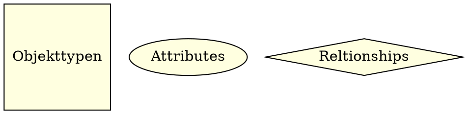

# Kapitel 6 - E/R Modell
**SLIDES:** [Datenbanken 6](file:///home/malte/OneDriver/01_Studium/3.Semester/Datenbanken/Slides/dbs1_06.pdf)

## Schema-Entwurf
**Generelle Aufgabe:**
- Finde eine formale Beschreibung (Modell) für einen zu
  modellierenden Teil der realen Welt

**Zwischenstufen:**
- Beschreibung durch natürliche Sprache (*Pflichtenheft*): 
  
  Bsp: "In der DB sollen alle Studierenden mit den durch sie belegten Lehrveranstaltungen gespeichert werden"

- Beschreibung durch abstrakte graphische Darstellungen (*ER-Modell*): 
  
  

- Beschreibung im relationalen Modell: 
  
  `create tabale student(...);`
  
  `create table lehrveranstaltung(...);`

# Das Entry-Relationship-Modell (E/R-Modell)
> Dient dazu, für einen Ausschnitt der realen Welt eine konzeptionelles schema zu erstellen
>
> Graphische Darstellung **E/R-DIAGRAMM**
> 
> Maschinenfernes Datenmodell
> 
> Hohes Abstraktionsniveau
> 
> Überlegungen zur Effizienz spielen keine Rolle
> 
> Das **E/R**-Modell muss in ein relationales Schema überführt werden:
> - Einfache Grundregeln zur Transformation
> - Gewinnung eines *effizienten* relationalen Schemas erfordert tiefes Verständnis vom Zielmodell


## Bestandteile des E/R-Modells
**Entries:** Objekttypen

**Attributes:** Eigenschaften

**Relationships:** Beziehungen



Entscheidende Aufgabe des Schema-Entwurfs:

→ Finde geeignete Entries, Attributes und Relationships

## Entities und Attributes
**Entries:**
- Objekte, Typen, "Seiendes"
- Objekte der realen Welt, *unterscheidbar*
- → Bsp: Mensch, Haus, Auto, ...

**Attributes:**
- Entities durch charakterisierende Eigenschaften beschrieben
- Einfache Datentypen wie `INT`, `STRING`, usw...
- → Bsp: Farbe, Gewicht, Name, ...
- Häufig beschränkt man sich auf die wichtigsten Attribute

**Schlüssel:**
- ähnlich definiert wie im relationalen Modell
- Primärschlüssel Attribute werden unterstrichen

## Relationships
> :eight_spoked_asterisk: **Definition:** Stellen Zusammenhänge zwischen Entries dar

→ Bsp:


Relationships können einige Attribute haben:
- → Bsp: Student *belegt* Vorlesung 
  
  *belegt* hat Attribut *Note*
  
- Mehrstellige (ternäre usw.) Relationships sind möglich: 
  
  


## Funktionalität von Relationships
### 1:1 Beziehung (one to one relationship)


**Charakteristik:**
- Jedes Objekt aus dem linken Entry steht in Beziehung zu **HÖCHSTENS** 
  einem Objekt aus dem rechten Entry und umgekehrt.

**Graphische Notation:**
- Pfeile auf jeder Seite

Das Beispiel gilt nur unter der Voraussetzung, dass jede Abteilung 
max. einen Leiter hat und kein Angestellter mehrere Abteilungen leitet.


### m:1 Beziehung (many to one relationship)


**Charakteristik:**
- Jedes Objekt auf der "many"-Seite steht in Beziehung zu höchstens einem 
  Objekt auf der "one"-Seite (im Allgemeinen nicht umgekehrt)

**Graphische Notation:**
- Pfeil in Richtung "one"-Seite


### m:n Beziehung (many to many relationship)


**Charakteristik:**
- Jedes Objekt auf der linken Seite kann zu mehreren Objekten auf 
  der rechten Seite in Beziehung stehen (d.h. keine Einschränkung)

**Graphische Notation:**
- Keine Pfeile

## Optionalität
> :eight_spoked_asterisk: **Definition:** Das E/R Modell trifft lediglich Aussagen darüber, 
> ob ein Objekt zu mehreren Objekten in Beziehung stehen darf oder zu max. einem

> :warning: **Warning:** Darüber, ob es zu mindestens einem Objekt in Beziehung stehen muss,
> **KEINE AUSSAGE**

**→ Erweiterte Notation:**
- *Geschlossener Kreis:* Verpflichtend mind. eins.
- *Offener Kreis:* Optional
- Gilt auch für Attribute (vgl. NOT NULL)


### Verschiedene Notationen


## ISA-Beziehungen/Vererbung
> :eight_spoked_asterisk: **Definition:** Das erweiterte E/R-Modell kennt Vererbungsbeziehungen 
> für Entities

→ Bsp:


**Charakteristik & Bedeutung:**
- Assistent ist ein Lehrender *(eng. 'is a')*
- Vererbung aller Attributes und Relationships

# Vom E/R Modell zur Relation

**Einfache Umsetzungsregel:**
- Entities und Attributes: 
  
  
- Jedem Entity-Typ wird eine Relation zugeordnet
- Jedes Attribut des Entity wird zu einem Attribut der Relation
- Primärschlüssel Entity → Primärschlüssel Relation
- Attribute können im weiteren Verlauf dazukommen: 
  
  `Kunde(KName, KAdresse, KTelefon, KEmail)`

**Bei Relationships:**

Umsetzung hängt von der Funktionalität/Kardinalität ab: 

| Funktionalität | Umsetzung                                    |
| ---            | -------------------------------------------- |
| 1:1            | Zusätzliche Attribute in bestehende Relation |
| 1:n            | Zusätzliche Attribute in bestehende Relation |
| n:m            | Erzeugung einer zusätzlichen Relation        |

> :memo: **Note:** Die ersten beiden Funktionalitäten sind 
> spezielle Fälle der dritten.

→ Deshalb ist es immer auch möglich, zusätzliche Relationen 
einzuführen, jedoch nicht erforderlich

## Vom E/R Modell zur Relation: 1:m Relationships (one to many)
**Relationhip:**


- Eine zusätzliche Tabelle wird nicht angelegt
- Der Primärschlüssel der Relation auf der **one**-Seite der Relationship 
  kommt in die Relation der **many**-Seite (Umbenennung bei Nameskonflikten)
- <span style="color:#cc241d;">Die neu eingeführten Attributes werden Fremdschlüssel</span>
- Die Primärschlüssel der Relationen ändern sich nicht
- Attribute der Relationship werden ebenfalls in die Relation 
  der **many**-Seite übernommen (kein Fremdschlüssel)

→ Bsp:


## Vom E/R Modell zur Relation: m:n Relationships (many to many)
**Relationhip:**


- Einführung einer zusätzlichen Relation mit dem Namen der Relationship
- **Attributes:** Die Primärschlüssel-Attribute der Relationen, 
  denen Entities der Relationship (also beider Seiten) zugeordnet sind
- Diese **Attributes** sind jeweils Fremdschlüssel
- Zusammen sind diese **Attributes** Primärschlüssel der neuen Relation
- Attribute der Relationship ebenfalls in die neue Relation übernommen

→ Bsp:


## Vom E/R Modell zur Relation: 1:1 Relationships (one to one)
**Relationhip:**


- Die beiden Entities werden zu einer Relation zusammengefasst
- Einer der Primärschlüssel der Entities wird zum Primärschlüssel der Relation: 
  ```
  Geraet(GeraetID, ..., AktenNr, ...)
         ^^^^^^^^primärer Schlüssel
  ```
- Häufig auch Umsetzung wie bei 1:n-Beziehung (insbesondere, wenn eine Seite optional ist), 
  wobei die Rollen der beteiligten Relationen austauschbar sind

## Vom E/R Modell zur Relation - Mehrstellige Relationen
**Mehrstellige Relation:**


- Eigene Relation für *empfiehlt*, falls mehr als eine 
  **Funktionalität many** ist:
  ```
  Dozent(PNr, ...)
         ^^^Primäreschlüssel
  Buch(ISBN, ...)
       ^^^primäreschlüssel
  Vorlesung(VNr, ...)
           ^^^Primärer Schlüssel 
  empfiehlt(PNr, ISBN, VNr)
            ^^^^^^^^^^^^^^Fremdschlüssel
  ```
  
## Vom E/R Modell zur Relation - Selbstbeziehungen
**Selbstbezug:**


## Vom E/R Modell zur Relation - ISA-Beziehung
**ISA-Beziehung:**


**Meist wie bei 1:m Beziehungen:**


Alternative: Attribute und Relationships von *Lehrender* 
explizit in *Professor(...)* übernehmen


# Unterschied E/R Diagramme zu UML
- Attributes werden direkt im Entity-Kasten notiert
- Relationships ohne eigenes Symbol (nur Pfeile)
	- Ausnahme: Ternäre Relationships mit Raute
- Verschiedene Vererbungsbeziehungen, Part-of-Bez.
- (Methoden: Nicht gebraucht bei DB-Modellierung)


