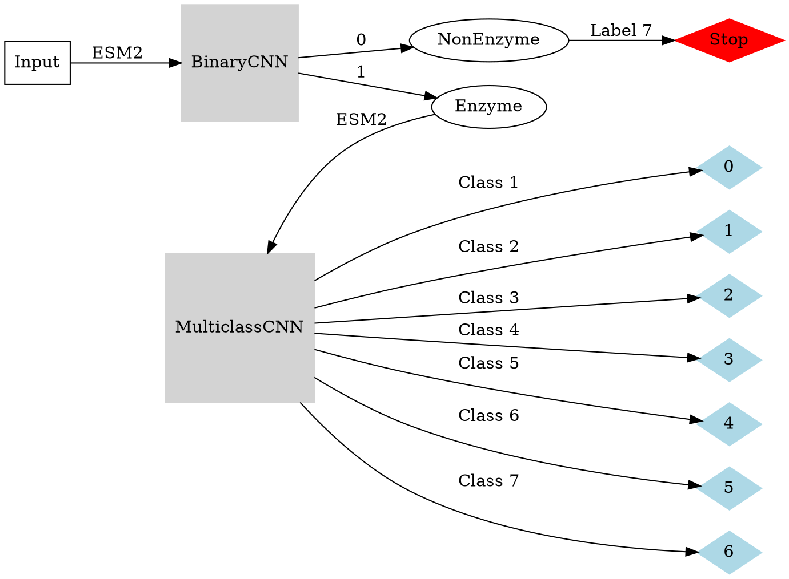

# Contents

- [03.10.2023](#03102023)
    - [Questions](#questions)
    - [Information about the datasets used for training](#information-about-the-datasets-used-for-training)
    - [Main Class Prediction](#main-class-prediction)
        - [CNN Split100 predicting only Main Class (= Model of last Meeting)](#cnn-split100-predicting-only-main-class-model-of-last-meeting)
    - [Enzyme/NonEnzyme Classification](#enzymenonenzyme-classification)
        - [CNN Split70 Binary Classifier (Optimized with Optuna)](#cnn-split70-binary-classifier-optimized-with-optuna)
            - [Combinding binary CNN with multi-class CNN](#combinding-binary-cnn-with-multi-class-cnn)
        - [CNN Split50 Main Class and Enzyme/NonEnzyme classification](#cnn-split50-main-class-and-enzymenonenzyme-classification)
    - [CNN 1st Subclass Prediction](#cnn-1st-subclass-prediction)
        - [1. Main Class 1st Subclass CNN](#1-main-class-1st-subclass-cnn)
        - [2. Main Class 1st Subclass CNN](#2-main-class-1st-subclass-cnn)
        - [3. Main Class 1st Subclass CNN](#3-main-class-1st-subclass-cnn)
        - [4. Main Class 1st Subclass CNN](#4-main-class-1st-subclass-cnn)
        - [5. Main Class 1st Subclass CNN](#5-main-class-1st-subclass-cnn)
        - [6. Main Class 1st Subclass CNN](#6-main-class-1st-subclass-cnn)
        - [7. Main Class 1st Subclass CNN](#7-main-class-1st-subclass-cnn)

# 03.10.2023

## Information about the datasets used for training

***All sampes used for training are:***
- $\le$ 1022 AAs long
- Don't contain AA "O|U"
- For Enzymes: No Multifunctional Enzymes (based on 1st EC number) are allowed

## Main Class Prediction 

### CNN Split100 predicting only Main Class (= Model of last Meeting)


## Enzyme/NonEnzyme Classification

### CNN Split70 Binary Classifier (Optimized with Optuna)


#### Combinding binary CNN with multi-class CNN


### CNN Split50 Main Class and Enzyme/NonEnzyme classification (Optimized with Optuna)


# Predicting 1st Subclass

## CNN 1st Subclass Prediction

**Split100 Class Distribution:**


### 1. Main Class 1st Subclass CNN

**Control:**
```zsh
~/Desktop/Dataset/data/enzymes/csv ❯ cut -f2 -d "," split100.csv | grep -P "^1.23" | wc -l
17
~/Desktop/Dataset/data/enzymes/csv ❯ cut -f2 -d "," split100.csv | grep -P "^1.20" | wc -l
64
```
**Label dictionary for outputlayer:**
```python
sec_to_label = {1: 0, 2: 1, 3: 2, 4: 3, 5: 4, 6: 5, 7: 6, 8: 7, 9: 8, 10: 9, 11: 10, 12: 11, 13: 12, 14: 13, 15: 14, 16: 15, 17: 16, 18: 17, 20: 18, 21: 19, 23: 20, 97: 21}
label_to_sec = {0: 1, 1: 2, 2: 3, 3: 4, 4: 5, 5: 6, 6: 7, 7: 8, 8: 9, 9: 10, 10: 11, 11: 12, 12: 13, 13: 14, 14: 15, 15: 16, 16: 17, 17: 18, 18: 20, 19: 21, 20: 23, 21: 97}
```


### 2. Main Class 1st Subclass CNN

**Control:**
```zsh
~/Desktop/Dataset/data/enzymes/csv ❯ cut -f2 -d "," split100.csv | grep -P "^2.9" | wc -l
241
~/Desktop/Dataset/data/enzymes/csv ❯ cut -f2 -d "," split100.csv | grep -P "^2.10" | wc -l
20
```
**Label dictionary for outputlayer:**
```python
sec_to_label = {1: 0, 2: 1, 3: 2, 4: 3, 5: 4, 6: 5, 7: 6, 8: 7, 9: 8, 10: 9}
label_to_sec = {0: 1, 1: 2, 2: 3, 3: 4, 4: 5, 5: 6, 6: 7, 7: 8, 8: 9, 9: 10}
```


### 3. Main Class 1st Subclass CNN

**Control:**
```zsh
~/Desktop/Dataset/data/enzymes/csv ❯ cut -f2 -d "," split100.csv | grep -P "^3.7" | wc -l
186
~/Desktop/Dataset/data/enzymes/csv ❯ cut -f2 -d "," split100.csv | grep -P "^3.8" | wc -l
54
~/Desktop/Dataset/data/enzymes/csv ❯ cut -f2 -d "," split100.csv | grep -P "^3.9" | wc -l
8
~/Desktop/Dataset/data/enzymes/csv ❯ cut -f2 -d "," split100.csv | grep -P "^3.10" | wc -l
1
~/Desktop/Dataset/data/enzymes/csv ❯ cut -f2 -d "," split100.csv | grep -P "^3.11" | wc -l
71
~/Desktop/Dataset/data/enzymes/csv ❯ cut -f2 -d "," split100.csv | grep -P "^3.13" | wc -l
24
```
**Label dictionary for outputlayer:**
```python
sec_to_label = {1: 0, 2: 1, 3: 2, 4: 3, 5: 4, 6: 5, 7: 6, 8: 7, 9: 8, 10: 9, 11: 10, 13: 11}
label_to_sec = {0: 1, 1: 2, 2: 3, 3: 4, 4: 5, 5: 6, 6: 7, 7: 8, 8: 9, 9: 10, 10: 11, 11: 13}
```


### 4. Main Class 1st Subclass CNN

**Control:**
```zsh
~/Desktop/Dataset/data/enzymes/csv ❯ cut -f2 -d "," split100.csv | grep -P "^4.5" | wc -l
2
~/Desktop/Dataset/data/enzymes/csv ❯ cut -f2 -d "," split100.csv | grep -P "^4.7" | wc -l
2
```
**Label dictionary for outputlayer:**
```python
sec_to_label = {1: 0, 2: 1, 3: 2, 4: 3, 99: 4, 6: 5, 7: 6, 5: 7}
label_to_sec = {0: 1, 1: 2, 2: 3, 3: 4, 4: 99, 5: 6, 6: 7, 7: 5}
```


### 5. Main Class 1st Subclass CNN

**Control:**
```zsh
~/Desktop/Dataset/data/enzymes/csv ❯ cut -f2 -d "," split100.csv | grep -P "^5.99" | wc -l
3
```
**Label dictionary for outputlayer:**
```python
sec_to_label = {1: 0, 2: 1, 3: 2, 4: 3, 5: 4, 6: 5, 99: 6}
label_to_sec = {0: 1, 1: 2, 2: 3, 3: 4, 4: 5, 5: 6, 6: 99}
```


### 6. Main Class 1st Subclass CNN

**Control:**
```zsh
~/Desktop/Dataset/data/enzymes/csv ❯ cut -f2 -d "," split100.csv | grep -P "^6.4" | wc -l
52
~/Desktop/Dataset/data/enzymes/csv ❯ cut -f2 -d "," split100.csv | grep -P "^6.6" | wc -l
41
```
**Label dictionary for outputlayer:**
```python
sec_to_label = {1: 0, 2: 1, 3: 2, 4: 3, 5: 4, 6: 5}
label_to_sec = {0: 1, 1: 2, 2: 3, 3: 4, 4: 5, 5: 6}
```


### 7. Main Class 1st Subclass CNN

**Label dictionary for outputlayer:**
```python
sec_to_label = {1: 0, 2: 1, 3: 2, 4: 3, 5: 4, 6: 5}
label_to_sec = {0: 1, 1: 2, 2: 3, 3: 4, 4: 5, 5: 6}
```


# Notes
- Group them in other (range) 
- How secure are we with prediction 
- Cache maybe 
- One model better then many 
- Pre analysis Both embeddings 
- Correlation calculation maybe Trend in size 
- Maybe run pca 
- Homology based inference 
